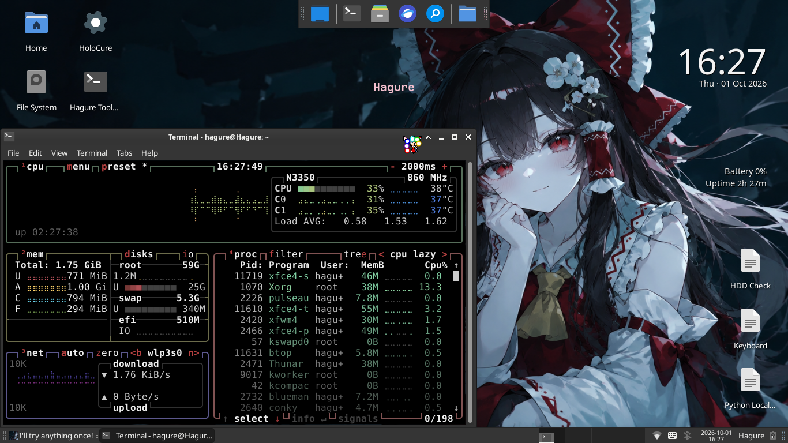

# Hagure's Linux Lab Notes

Welcome to my learning and troubleshooting log.

## Purpose

- Write down what I learn on old, low-spec computers.
- Keep a record of real problems, and how I fixed them (or failed to fix them).
- Build a personal portfolio of practical Linux and system troubleshooting.

## My laptops

Most notes are about these three laptops. All of them are low-spec on purpose.

| Laptop | CPU | RAM | Notes |
|---|---|---|---|
| Celeron N3xxx laptop | Intel Celeron N3xxx | 2 GB | Debian, XFCE and bspwm. Most notes are about this one. |
| Dell Inspiron 3138 | Intel Celeron N2815 | 4 GB | Windows Ghost Spectre and Debian dual boot. |
| Laptop 3 (Acer Aspire E1-470) | Intel Core i3-3217U | 2 GB | Debian and FreeBSD. |

## Categories

- **System** — [Bluetooth OBEX Fix](./system/bluetooth-obex-fix.md), [Scroll Lock LED Fix](./system/scrolllock-led-fix.md), [SMART/HDD Health Check](./system/smart-hdd-check.md), [Manual Toolbox Script](./system/toolbox-script.md), [Quod Libet Crash Reset](./system/quodlibet_crash_reset_summary.md), [System Tuning (N3xxx)](./system/system-tuning-n3xxx-summary.md)
- **Boot** — [Boot Chain Theming Recap](./boot/boot-chain-theming-recap.md), [Debian GRUB Cerydra Setup](./boot/debian-grub-cerydra-setup.md), [GRUB Reimu Theme Session](./boot/grub-reimu-theme-session.md), [EFI Partition Size (512 vs 513 MiB)](./boot/efi-partition-size-512-vs-513-mib.md), [Arch Linux Boot Fail on Legacy BIOS](./boot/arch-linux-installation-failed-legacy-bios.md)
- **Desktop** — [Live Wallpaper Log (Debian XFCE)](./desktop/live-wallpaper-debian-xfce-log.md), [Live Wallpaper System](./desktop/live-wallpaper-system.md), [Conky: Keep Visible on XFCE](./desktop/conky-xfce-keep-visible.md), [XFCE Nordic Theme Setup](./desktop/xfce-nordic-theme-setup.md), [XFWM4 Desktop Zoom Fix](./desktop/xfwm4-desktop-zoom-fix.md)
- **Theming** — [Reimu Mouse Cursor Session](./theming/reimu-cursor-session.md)
- **Tuning** — [Stress Test on a Tuned Laptop](./tuning/low-spec-stress-test.md), [zram Hybrid Mode (draft)](./tuning/zram-hybrid-draft.md)
- **Optimization** — [Laptop 3 Debian Optimization (draft)](./optimization/laptop-3-debian-optimization-draft.md)
- **Storage** — [USB Flashdisk Test and Setup](./storage/usb_flashdisk_test_setup.md), [Home Directory Reorganization](./storage/home-directory-reorganization.md)
- **Hardware** — [Webcam Troubleshooting](./hardware/camera-webcam-troubleshooting.md)
- **FreeBSD** — [FreeBSD 15.1 on Laptop 3: Install Log](./freebsd/freebsd-laptop3-installation-full-log.md)
- **Android** — [Windows Ghost Spectre to Debian Dual Boot, and Waydroid](./android/windows-ghost-spectre-debian-dualboot-waydroid.md)
- **Windows** — [Windows Ricing (draft)](./windows/windows-ricing-draft.md), [MiniStat.ini (Rainmeter skin)](./windows/MiniStat.ini)
- **Gaming** — [Ender Lilies on Wine (N3xxx)](./gaming/ender-lilies-wine-n3xxx.md), [Ender Lilies: bspwm GPU Hang](./gaming/ender-lilies-bspwm-gpu-hang.md), [Momodora on Wine](./gaming/momodora-wine-debian.md), [Prism Launcher: Minecraft 1.7.10](./gaming/prism_launcher_1.7.10_session.md), [Minecraft FPS Test: Baseline](./minecraft-fps-tests/baseline/README.md)
- **Learning** — [Folder Organization: What I Learned](./learning/folder-organization-learning.md), [Android Calculator Mod](./learning/android-calculator-mod.md)
- **Reference** — [Shortcut Cheat Sheet](./reference/shortcuts-cheatsheet.md)

## Templates

The [`Examples/`](./Examples) folder has simple templates. You can copy them when you write a new note in this style:

- [Redesign project](./Examples/CalculatorExample.md)
- [System tuning experiment](./Examples/DebianZRAMExample.md)
- [Mistakes and lessons log](./Examples/NotesMistakesExample.md)

## About me

I run Debian on low-spec laptops and I like to make old hardware work well again, instead of buying new hardware. Most of these notes started as a small problem (a password prompt, an LED that would not stay on) and became a deeper look at how Linux works inside.

I use AI tools when I work. But I test every fix myself and I try to understand it, including the times when the first answer from the AI was wrong.

## License

Code is licensed under [MIT](LICENSE-CODE).
Notes and documentation are licensed under [CC BY-NC 4.0](LICENSE-DOCS.md).
